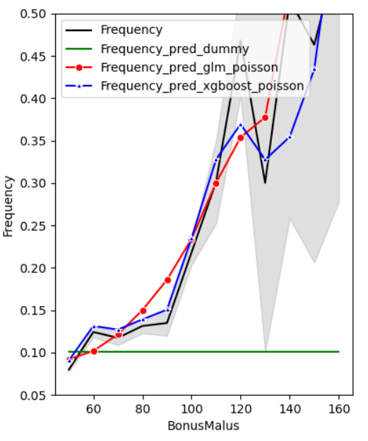
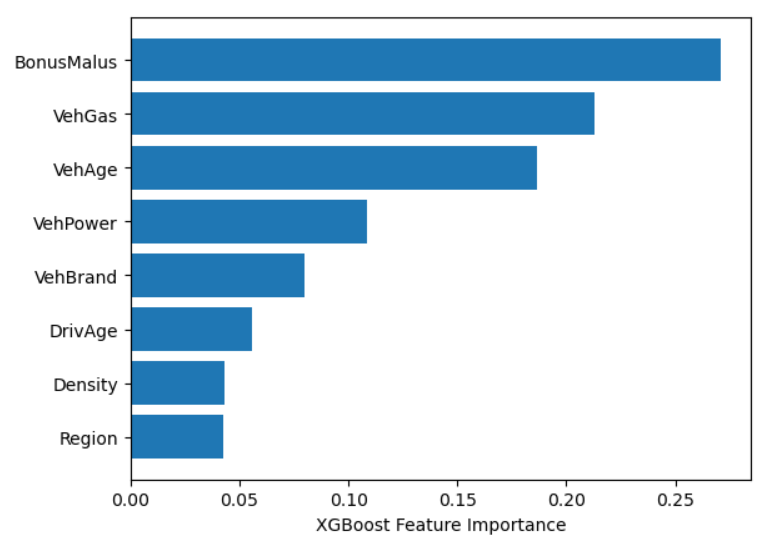

# Kfz-Haftpflichtversicherungsschäden-Modellierung

Autor: <a href="https://github.com/micvolk">Michael Volk</a>

## Überblick

- Schadenwahrscheinlichkeit und Schadenaufwand bzgl. Kfz-Haftpflichtversicherungsverträgen auf Basis eines Generalized Linear Model (GLM) und eines Extreme Gradient Boosting Model (XGBoost) prognostiziert
- Öffentlich verfügbarer, französischer Kfz-Haftpflichtversicherungs-Datensatz ``freMTPL2`` diente als Datengrundlage für Training & Validierung der Modelle (~ 678 Tsd. Verträge, 9 Risikomerkmale)
- Gute Prognose-Genauigkeit hinsichtlich Schadenwahrscheinlichkeit, mit leicht besseren Ergebnissen für XGBoost-Modell
- Dagegen Prognose-Genauigkeit hinsichtlich Schadenaufwand pro Schadenfall schlechter als simple Vorhersage des Portfoliomittelwerts => Überanpassung der Modelle auf Basis der verrauschten Trainingsdaten (nur ~24 Tsd. Verträge weisen Schäden auf)
- Marginale Schadenwahrscheinlichkeit bzgl. einzelner Risikomerkmale wird gut abgebildet von beiden Modellen - s. Beispiel-Darstellung bzgl. des Risikomerkmals Bonus-Malus-Score (analog zu Schadenfreiheitsklasse, aber niedriger Score gut und hoher Score schlecht):

	
		
- Aber bzgl. einiger Risikomerkmale systematisch leicht zu hohe Prognose der Schadenwahrscheinlichkeit
- Modellkalibrierung insgesamt aber gut, d.h. sowohl bzgl. kleiner oder mittlerer oder großer Prognosewerte wird im Durchschnitt die tatsächliche Schadenhäufigkeit gut prognostiziert
- Risikomerkmale Bonus-Malus-Score ``BonusMalus``, Kraftstoffart ``VehGas``, und Fahrzeugalter ``VehAge`` sind gemäß XGBoost-Modell die wichtigsten Merkmale für die Reduzierung der Kostenfunktion (auf Basis von Poisson-Abweichung):

	
	
- Dabei gibt es auf Basis eines erstellten Entscheidungsbaums Indizien dafür, dass die Wichtigkeit des Merkmals Kraftstoffart auf eine spezielle Hochrisikogruppe (evtl. Mietwagenverleih) im Datensatz zurück zu führen ist
- Auf Basis der Ergebnisse abgeleitete Fragestellungen für zukünftige Forschungen:
  - Lässt sich Prognose-Genauigkeit hinsichtlich Schadenaufwand pro Schadenfall verbessern, z.B. durch Kreuzvalidierungsvalidierungsverfahren in Kombination mit Hyperparameter-Tuning der Modelle?
  - Wie ist Diskrepanz zwischen systematisch leicht zu hoher Prognose der Schadenwahrscheinlichkeit und insgesamt guter Modellkalibrierung erklärbar?
  - Reduziert sich die Bedeutung des Merkmals Kraftstoffart deutlich wenn synthetisches Extra-Merkmal bzgl. der speziellen Hochrisikogruppen (evtl. Mietwagenverleih) verwendet wird?

## Vorgehen

Alle beschriebenen Schritte werden in dem Jupyter-Notebook ``Kfz-Haftpflichtversicherungsschaeden-Modellierung.ipynb`` auf Basis von Python 3.9 durchgeführt. Das Notebook kann auch als reine HTML-Version mit oder ohne Python-Code-Darstellung aufgerufen werden:

- [Kfz-Haftpflichtversicherungsschaeden-Modellierung mit Code](https://micvolk.github.io/Kfz-Haftpflichtversicherungsschaeden-Modellierung/presentation/Kfz-Haftpflichtversicherungsschaeden-Modellierung_mitCode.html)
- [Kfz-Haftpflichtversicherungsschaeden-Modellierung ohne Code](https://micvolk.github.io/Kfz-Haftpflichtversicherungsschaeden-Modellierung/presentation/Kfz-Haftpflichtversicherungsschaeden-Modellierung_ohneCode.html)

Ziel ist es Modelle bzgl. Schadenwahrscheinlichkeit und Schadenaufwand auf Basis eines öffentlich verfügbaren, französischen Kfz-Haftpflichtversicherungs-Datensatzes abzuleiten und diese dann zu trainieren und zu validieren.

Zunächst wird mit der Exploration der Daten mittels univariater und multivariater Analysen begonnen. Im Laufe der Datenexploration und Datenanalyse werden bereits Datenaufbereitungen vorgenommen, die für die Visualisierung und spätere Modellierung als Grundlage dienen. Schließlich erfolgt die Modellierung um Schadenwahrscheinlichkeit und Schadenaufwand für einen Vertrag mit gegebenen Risikomerkmalen prognostizieren zu können. Sowohl für die Modellierung der Schadenwahrscheinlichkeit als auch für den Schadenaufwand werden jeweils folgende 3 Modelle in unterschiedlichen Konfigurationen verwendet:
- Dummy-Regressor: Trivial-Modell als Basisvergleichslinie
- Generalized Linear Model (GLM): gängiges Modell bei Versicherungen
- Extreme Gradient Boosting (XGBoost) Model: relativ neues, auf breiten Gebieten erfolgreiches Machine-Learning-Modell

Dazu werden die Daten in Trainings- und Testdaten aufgespalten und weiter verarbeitet in eine für das jeweilige Modell passende Form. Die Modelle werden dann jeweils auf Basis der Trainingsdaten trainiert. Das jeweilige trainierte Modell wird dann auf die Testdaten angewendet und geprüft anhand verschiedener Kritierien im Vergleich zu den anderen Modellen:
- Scoringwerte bzgl. Metrik aus Kostenfunktion
- Marginale Schadenwahrscheinlichkeiten bzgl. einzelner Merkmale ggü. tatsächlichen, marginalen Schadenhäufigkeiten
- Modellkalibrierung

Zudem erfolgt eine Analyse der wichtigsten Merkmale bzgl. dem XGBoost-Modell und bzgl. eines einfachen Entscheidungsbaums.

## Beschreibung der Daten

Der französische Kfz-Haftpflichtversicherungs-Datensatz besteht aus den beiden Dateien freMTPL2freq.csv und freMTPL2sev.csv, welche jeweils eine Tabelle beinhalten, die über die Vertragsnummer miteinander verbunden werden können. Die Daten wurden von Karan Sarpal über Kaagle zur Verfügung gestellt und von dort herunter geladen (s. [1]). Sie wurden aber wohl ursprünglich von Christophe Dutang und Arthur Charpentier veröffentlicht auf Basis der Daten eines unbekannten privaten Versicherers (s. [7], Abschnitt freMTPL). Die folgende Beschreibung der Daten wurde weitestgehend aus [7] übernommen.

Datei freMTPL2freq.csv enthält die Vertragsdaten und Schadenanzahl bzgl. dem jeweiligem Versicherungsvertrag.
Datei freMTPL2sev.csv enthält den Schadenaufwand bzgl. dem jeweiligem Versicherungsvertrag.

Beschreibung der Spalten in Datei freMTPL2freq.csv:
- IDpol: Vertragsnummer der Versicherung, zwecks Verknüpfung mit Vertragsnummer in freMTPL2sev.csv
- ClaimNb: Anzahl an Schäden innerhalb des Versicherungszeitraums (=Spalte Exposure)
- Exposure: Zeitraum in Jahreseinheiten in welcher der Vertrag versichert war
- Area: Der Dichtewert der Stadtgemeinde, in der der Autofahrer lebt: von "A" für ländliche Gegend bis "F" für Stadtzentrum.
- VehPower: Motorleistung (geordnete Werte)
- VehAge: Alter des Fahrzeuges
- DrivAge: Alter des Fahrers
- BonusMalus: Bonus/Malus-Score, zwischen 50 und 350: <100 bedeutet Bonus, >100 bedeutet Malus in Frankreich.
- VehBrand: Automarke (unbekannte Kategorien)
- VehGas: Kraftstoff des Fahrzeugs (Diesel oder regulär)
- Density: Die Einwohnerdichte (Anzahl der Einwohner pro Quadratkilometer) der Stadt, in der der Autofahrer wohnt
- Region: Die Verwaltungsbezirke in Frankreich (basierend auf der Klassifikation 1970-2015).

Beschreibung der Spalten in freMTPL2sev.csv:
- IDpol: Vertragsnummer der Versicherung, zwecks Verknüpfung mit Vertragsnummer in freMTPL2freq.csv
- ClaimAmount: Schadenaufwand in €

## Verwendete Quellen

- [1] Sarpal, Karan, Kfz-Haftpflichtversicherungs-Daten freMTPL2freq.csv und freMTPL2sev.csv, https://www.kaggle.com/datasets/karansarpal/fremtpl2-french-motor-tpl-insurance-claims?resource=download
- [2] Noll, Alexander und Salzmann, Robert und Wuthrich, Mario V., Case Study: French Motor Third-Party Liability Claims (March 4, 2020). https://ssrn.com/abstract=3164764 oder http://dx.doi.org/10.2139/ssrn.3164764
- [3]  Wuthrich, Mario V. und Buser, Christoph, Data Analytics for Non-Life Insurance Pricing (October 27, 2021). Swiss Finance Institute Research Paper No. 16-68, https://ssrn.com/abstract=2870308 oder http://dx.doi.org/10.2139/ssrn.2870308 
- [4] Lorentzen, Christian und Yurchak, Robert und Grisel, Olivier, skicit-learn Beispiel: [Poisson regression and non-normal loss](https://scikit-learn.org/stable/auto_examples/linear_model/plot_poisson_regression_non_normal_loss.html#sphx-glr-auto-examples-linear-model-plot-poisson-regression-non-normal-loss-py)
- [5] Schweizerische Aktuarvereinigung, Jupyter-Notebook: [00_Descriptive_Analysis](https://colab.research.google.com/drive/1dvD1OaWKO9RyxtF78NRsEKbFrOr62xU8?usp=sharing#scrollTo=jt2s9GsdaAoC)
- [6] Tiwari, Ajay: https://medium.com/swlh/modeling-insurance-claim-severity-b449ac426c23
- [7] Dutang, Christophe und Charpentier, Arthur, Beschreibung der Daten: http://cas.uqam.ca/pub/web/CASdatasets-manual.pdf

